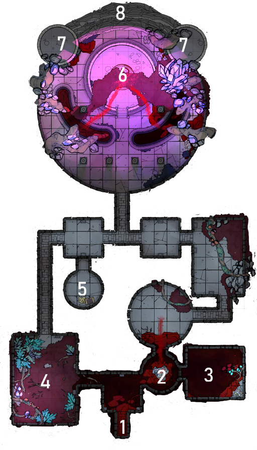

# City of Andar

## Table of contents
{: .no_toc }
1. TOC
{:toc}

## City Layout
The upper level of Deepak Height are home to royalties, nobility and intellects. The middle level is where the merchants, crafts people and the middle class mingle. In the depths, Rasatal housed the unwanted and the unsightly of societies.

A map of Andar, revealing layers of the city.

---
## Society
Andar is separated by class, wealth and dignity. Each layer has its own norms and expectations. By social law, families of different classes aren’t allowed to marry, and intermingling is frowned upon. Transgressions are met with death.

{: .highlight}
 The players can take advantage of being an outsider to gain different perspectives and favours for their quests. Cleaners for example would have back access because their employers don’t want them to be seen in front of the guests.

---
## Rasatal
Accessed through ramps from Andhera Alley, the neglected subterranean district of Rasatal is roughly shaped and old, with doors and windows poking out to let in air. Columns of grimy apartments serve as supporting beams for the city above. 

{: .highlight}

People have been found wandering aimlessly in Rasatal, with reduced memories and mental capacity.

---
## Abandoned Mine
The main entrance is a door that can only be unlocked by lighting its censer which then creates an air pressure and whistles like a flute, and closing four palm-sized spaced out holes along the walls. It was a mechanism created to ensure no one goes in alone and unprepared.
Inside, ogres make their home here, feasting on the creatures there and an unlucky passerby. The furthest end led to an ancient tomb, long forgotten.

A map of an abandoned mine, long disused and overtaken by pest and creatures.

**LAYOUT**
1. Entrance
2. Snake infested pit
3. Ogre sleeping, will hunt player if they are being too loud. The ogre prefer to attack women and enjoys being hurt.
4. Abandoned mining site. Uncut gems can be pilfered here.
5. Narrow passageway.
6. Hanging bridge, can only hold one person at a time.
7. Quarters. Acquisition ledgers and simple equipment.
8. Deep pool of uneasily warm not-blood.
9. Entrance to the Tomb of Feast. 
10. Hidden treasure.

---
## Tomb of Feast
The tomb can be entered through Rasatal’s abandoned mine, or from an opening in the ceiling in the middle of the altar, that connects directly to the Royal Varsha Palace, top of the city.
Large tree roots overtook most of the structure, and red seawater pools in the lower levels. Aether, a powerful magical substance, grew on these roots.
A coven of vampires recently took shelter in this tomb, blissfully unaware of the history of the tomb.

A map of the Tomb of Feast. Blood pools the ground.

**LAYOUT**
1. Entrance
2. Piles of bloodless bodies, an opening in the ceiling that leads to Soodagar District.
3. Skeleton cradling treasure
4. Valuable aether growing on tree roots.
5. Secret treasure with hidden entrance.
6. Sacrificial altar, there is an opening in the ceiling that leads to the Royal Palace.
7. Vertical platforms, 10ft up.
8. Sheer drop.

{: .note-title }
> Lore
> 
> Tomb of Feast was once a sacred place where gods would consume lesser gods as a form of syncretizing. Where two gods can become one.

 

[Back to the top](#city-of-andar)