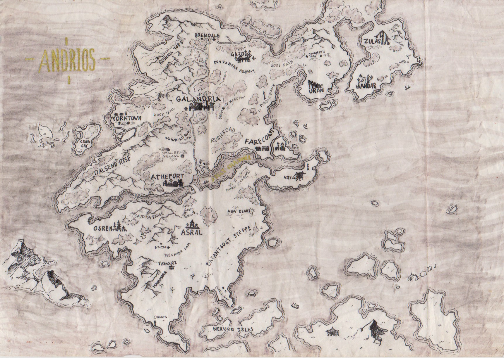

# Andrios

Andrios is the name of continent in the southern-hemisphere of planet Hos, which has connections and portals to other planes of reality. The land was split during the **Sundering**.

## History
_Main article: [History of Andrios]()_

There has been five distinct eras since the discovery of the continent: the Era of Settlers, the Dwarvern Era, the Cthonic Era, the Empyrean Era, and the most recent Sundered Era.

---

## Religion
_Main article: [Religions of Andrios]()_

The dieties of Andrios reign over multiple but distinct domains, which they gained authority over by syncretizing with other lesser gods.

### Primary Deities
- Sollian, the Sun God
- Nylmat, the Moon Goddess
- Gaiun, the Caretaker
- Nex, the Liberator

---

## Regions
[Galandris Empire]()

[Andarm Federation]()

[Republic of Tasid]()
