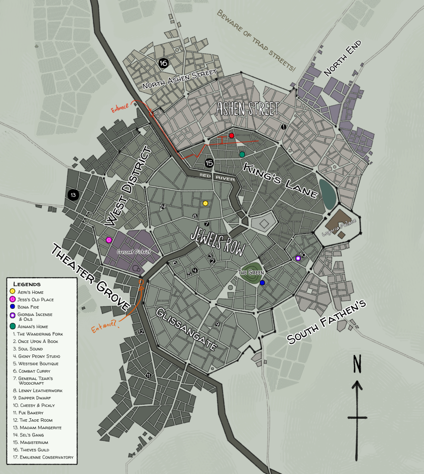

# City of Galandria

Capital and the beating heart of the Galandris Empire. Centuries-old layers of limestone walls barricades the city against outsiders. The city is dotted with secret entrances into an underground network, home to the poor and the runaways.

    

A city map of Galandria, with marked entryways into an underground network.

### Theater Grove
Where the artistes, and charming vagrants make their home.

### Ashen Street
The labourers, and their factories, where they toil for a better living.

### King's Lane
The oldest and the richest district in the city. This is where the nobles, the bureaucrats, the richest merchants, and their servants live in wealthy and extravagant lives. Faded red bricks line the streets.

### Jewels Row
The craftspeople, the clerks, the middlemen, and the intellectuals. The middle class live in this modest but comfortable district. This is where most of the fine products are being produced, after the raw materials have been processed from West District, and Ashen Streets.

There is a textile factory that houses over a hundred lace makers, mostly women, in West Jewels Row.

### The Green
The story goes that a noble was killed in a horrific accident and his lover ran away scared of the creature he has become. Now his home has completely taken over for aeons, and what is left is a patch of proud tall trees that blooms amidst the busy city.

Beneath a twisting tree lay a secret cafe, ran by an druidic gang called the Rings.

 

[Back to the top](#city-of-galandria)