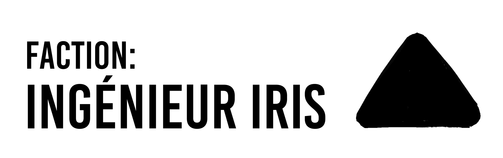

# Factions

{: .no_toc}

After the fall of states, borders, and laws, came the question of how to organize society in this new world.

**Alias: Arbitrators**

Like most institutions, many laws and regulations decayed away by the end of the Extraction Era. The lawyers barely survived. They now travel the land with a gaggle of understudy in tow, arbitrating conflicts and disputes that require an outsider perspective and wisdom.

{: .note}
They used to have their discussions open to the public to participate, but recently they set their posting privileges to members only after a very ugly spam attack.

---

**Alias: Moralists**

> Someone has to keep updating the standards of concrete strength and food safety or we will all die.

A loose alliance of intellectuals who congregate twice a cycle to discuss developments, archives, regulations, moral issues and ethics of their individual projects. They publish articles daily but the general public tend to skip over them because of how verbose and technical their texts tend to be.

---

**Alias: Heirs/Lords**
The remnants of the City Lords, hellbent on restoring the glory days of their Extraction era reign. Their leaders, called the Lords, believe that might makes right, and that leadership and authority are needed to spearhead humanity to far greater heights. Some just want to hoard all the resources in the world. Their foot soldiers are called the Heirs. They are trained in the arts of Neurohack and disruptive machines.

---

**Alias: Iris / The Engineers**
**Notable Figure: Senior Supervisor Pearclaw**

A tech-driven paramilitary faction that vows to serve the people and deter the Deathless. They take up whatever supplies and space they wish, even when it’s against other people’s interests. Public perception is that Iris over-vigilance is unnecessary when local communities could adequately defend themselves.

Originated in Asadal, by cycle 472th of the Era of Concord, Iris now has presence in almost every region. They maintain the Long Tracks (a planet-wide nucleartrain network) and the inter-region Neurolink towers.

---

**Alias: Traders**
**Notable Figure: Purveyor Maylin**

Initially organized in Sayang, they travel the planet exchanging goods and services to fulfil the whims and needs of people. They take pride in bringing joy and surprises to locals. If you have no desires, they will make sure you have one before they leave.

