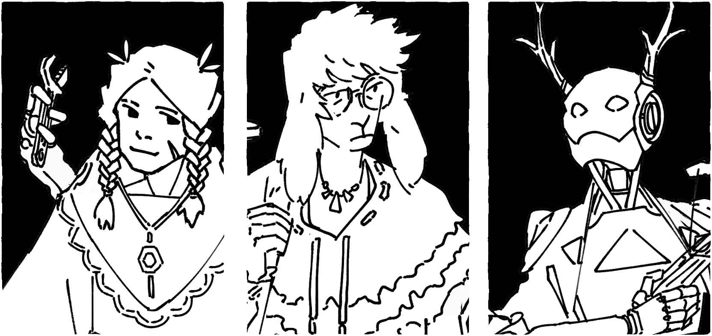

# Forms of Humanity
After the end of the **Extraction Era**, new lifeforms began to emerge, notably the **Adapted** who were mutated with human ancestors, and **Synthetics**, machines who gained consciousness. By online census, they are all considered as different forms of humanity and should be treated as humans. As the **Era of Concords** began, most people agreed that there are three forms of humanity: Oldblood, Adapted, and Synthetics.

The three forms of humanity.

## Oldblood
> All they have are scant memories and twisted histories. Ancient techs recognize them as citizens of the world, but what does it matter when that world is long gone?

Living fossil of the earlier human specie, biologically unchanging in the changed world. Outside of sheltered havens, Oldblood requires assistive technologies to traverse the extreme biomes and landscape.

## Adapted
> To survive the frought environments or to push themselves beyond the known boundary that defines them. Adapted are people changed by the world, and people who changed themselves.

Generations of mutation and survival with the background radiation left by the Extraction Era, the Adapted are naturally suited to be in the world as they are, extra limbs or not. Wild beasts are less likely to notice the Adapted in a group of adventurers.    

## Synthetic
> Made to be more than machines, the Synthetics were humanity's children, boundless in drive and creativity.

Made of synthetic fibres, metal shells or jelly membranes, most synths resemble the people of Oldblood, but some are keen to experiment new shapes and platforms. The Deathless favors attacking Synthetics to spread the **Empty Song**.

