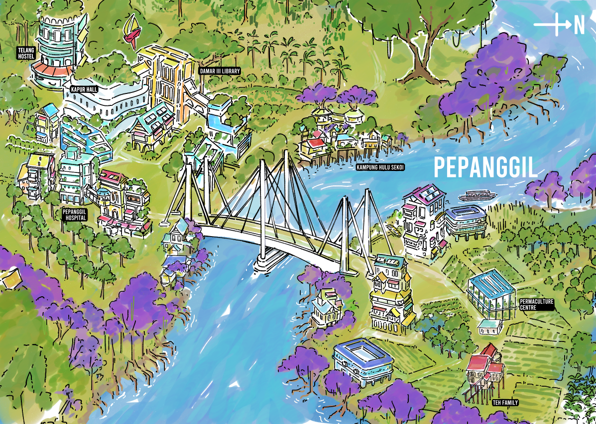

# Pepanggil Town

A town map of Pepanggil.

**Region:** Sayang  
**Population:** Less than 1000  
**Weather:** Sunny skies, thunderstorms, and floods.

Between the fallen ruins of the old world, nestled up a gentle flowing river is the lively town of Pepanggil. Located at the edge of civilization, and within distance of a nightlife.

Telang Hostel is open for visitors of the town to rest and recuperate from long adventures and journeys.

Empty buildings dots the town, filled with memories, and potential for renovation and repurpose.